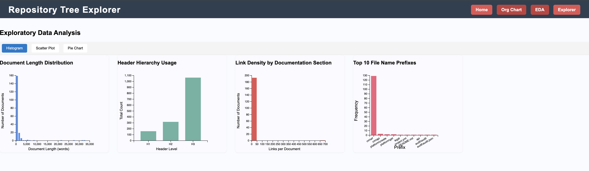
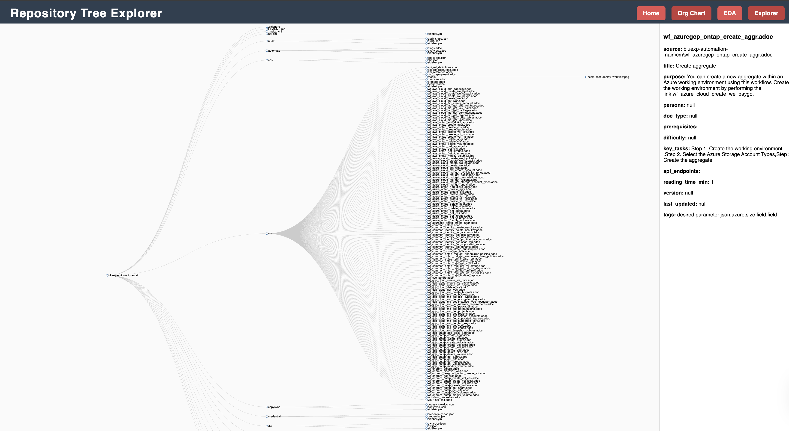
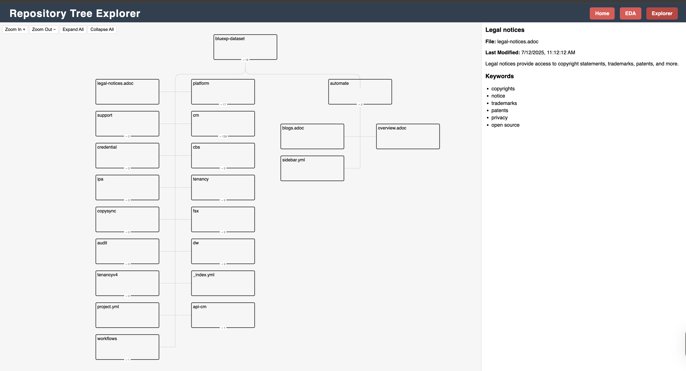

# DATA992-Summer-2025-Team1

# _Capstone Project_

## Table of Contents
### [1. Project Overview](#project-overview)
   - [Problem Statement](#problem-statement)
   - [Objectives](#objectives)
   - [Contributors & Roles](#contributors--roles)
   - [Project Plan](#project-plan)
   - [Schedule & Milestones](#schedule--milestones)
   - [Project Challenges](#project-challenges)

### [2.  Repository Structure](#repository-structure)
### [3.  Data](#data)
   - [Data Source](#data-source)
   - [Data Plan](#data-plan)
   - [Data Analysis](#data-analysis)
   - [Data Visualization](#data-visualization)
   - [Data Dictionary](#data-dictionary)
   - [Data Cleaning & Validation](#data-cleaning--validation)
### [4.  Literature Review](#literature-review)

### [5.  Final Presentation](#final-presentation)
   - [Running](#running)
   - [Feedback & Next Steps](#feedback--next-steps)

---

## Project Overview:

### Problem Statement:

NetApp’s extensive library of technical documentation, authored in AsciiDoc and hosted on GitHub, plays a crucial role in product development, customer support, and implementation success. However, the unstructured nature of this content makes it difficult to retrieve relevant information quickly—resulting in slower onboarding, longer troubleshooting times, and inconsistent knowledge sharing.
We aim to address this challenge by developing a metadata enrichment system using natural language processing and machine learning. The focus will be on the bluexp-automation repository, analyzing text blocks, headers, code, and tables to extract key entities, topics, semantic relationships, and contextual tags. This enriched metadata will feed into a prototype retrieval system that significantly enhances searchability and contextual understanding.
The project will be constrained by access to existing documentation, GitHub-based workflows, and available compute for NLP models. It must deliver a working prototype, performance metrics comparing baseline and augmented search, and visualizations that communicate its impact.
Stakeholders—including NetApp documentation teams, internal engineers, and external users—will benefit from faster, more accurate access to the right documentation at the right time. Ultimately, the project will help NetApp improve operational efficiency, reduce cognitive load for its users, and set a precedent for intelligent document retrieval systems.

---

### Objectives:

- Explore and analyze NetApp open-source documentation - beginning with the BlueXP-Automation API repository.
- Employ NLP models to identify and extract key entities, concepts, and relationships within the textual content, enhancing the metadata with semantic tags and topic modeling results

---

### Contributors & Roles:

#### Contributors:

[Adam Green](https://www.linkedin.com/in/agreen01/) | [Hubert Hwang](https://www.linkedin.com/in/hubert-hwang-1280076a) | [Jimmy Kruse](https://www.linkedin.com/in/jimmy-kruse-a7a021122) | [Dorn Lee](https://www.linkedin.com/in/dorn-l-79b204a7/) | 
| :----------------------------------------------------------------------------------------------------------------------------------------------------------------: | :----------------------------------------------------------------------------------------------------------------------------------------------------------------: | :----------------------------------------------------------------------------------------------------------------------------------------------------------------: | :-------------------------------------------------------------------------------------------------------------------------------------------------------------: |
|  |  |  |  |
|[ ](https://github.com/agreen8911)   |   [ ](https://github.com/hhwang919)    |   [ ](https://github.com/jrkruser)    |   [ ](https://github.com/dl9133)    |
|[  ](https://www.linkedin.com/in/agreen01/) | [  ](https://www.linkedin.com/in/hubert-hwang-1280076a) | [  ](https://www.linkedin.com/in/jimmy-kruse-a7a021122) | [  ](https://www.linkedin.com/in/dorn-l-79b204a7)     |          

####  Roles:

| Member        | Role             | Duties                                                                 |
|---------------|------------------|------------------------------------------------------------------------|
| Adam Green    | Data Engineer    | Ensure GitHub repo is updated, consolidate models, refactor code       |
| Dorn Lee      | Project Manager  | Communicate with stakeholders, organize meetings, manage team tasks    |
| Jimmy Kruse   | ML Developer     | Build and evaluate models (BERT, LLM, Grading)                         |
| Hubert Hwang  | Lead Researcher  | Provide a list of candidate models/techniques for the group            |

---

### Project Plan:

#### Scope:

Utilizing NLP techniques, generate enriched metadata tags to augment existing search retrieval processes and improve returned results, including both the total number of relevant documents and the highest quality (highest relevance) documentation.

#### Methodology:

- Extract repository(ies) text to be analyzed utilizing Python methods.
- Conduct data preprocessing to ensure a clean training/evaluation dataset.
- Generate metadata tags utilizing NLP techniques, such as BERT-based models, including KeyBERT and LLM-generated tags.
  - Metadata tag generation approaches being explored include:
    - BERTopic Modeling with RAKE & TF-IDF
    - Fine-tuned T5 model with KeyBERT and a secondary grading model for tag quality evaluation
    - LLM-augmented generation
- Build and integrate a secondary **grading model** to evaluate the relevance of generated tags to document content.
  - Grading model assigns a score to the relevancy of the generated tag (from the first model) and classifies it as relevant (1) or not (0).
- Test project methodology via user-defined querying and comparing returned NetApp documentation.

###  Schedule & Milestones

####  Sprint 3 Release (June 22)
- Access zipped GitHub repo for `.adoc` files
- Review literature for modeling techniques
- Explore BERT, LLM, and grading models
- Begin testing to establish a baseline
- Generate metadata tags using NLP
- Perform EDA analysis
- Formulate Project Plan

####  Group Status Report (June 27)
- Report team progress to stakeholders
- Share model testing results
- Present short- and long-term goals
- Discuss issues and blockers

####  Sprint 4 Release (July 6)
- Evaluate techniques:
  - KeyBERT + cosine similarity
  - KeyBERT + nearest neighbor
  - KeyBERT + T5
  - BERTopic with RAKE & TF-IDF
  - LLM augmentation
- Compare and optimize models

####  Data Visualization (July 14)
- Visualize data summary and stats
- Present the metadata tag pipeline
- Show model performance
- Analyze terminology in tags

####  Sprint 5 Release (July 20)
- Final testing and evaluation
- Identify best-performing models
- Finalize visualizations and insights
- Summarize key findings
- Prepare final presentation

####  Data Analysis (July 21)
- Techniques: Zero-Shot Facebook BART, Word2Net
- Built Data Visualizations with D3.js
- Evaluate tag relevance
- Score the tags with the grading model

####  Final Presentation (July 23)
- Dynamic visuals (building UI utilizing React & TailwindCSS)
- Summary of findings
- Key achievements and insights
- Recommendations
- Dashboard demo

---

###  Project Challenges

- Queries may lack context or be overly brief (e.g., one-word queries)
- Similar content across `.adoc` files causes retrieval conflicts
- No stakeholder-defined test plan or benchmark exists for comparison
- Lack of performance baseline from NetApp’s current metadata system

---

## Repository Structure

```
Summer-2025-Team1/
├── .github/
│   ├── CODEOWNERS
│   └── workflows/                # (optional CI/CD setup)
│       └── main.yml
├── .gitignore
├── README.md
├── requirements.txt
├── setup.py

├── data/                         # Raw and processed data
│   ├── bluexp/                   # More concise than "bluexp-dataset"
│   │   ├── uuid_file_map.csv
│   │   └── tenancy/              # More generic than "tenancyv4"
│   │       └── tenancy.yaml

├── docs/                         # Project documentation
│   └── literature_review.md

├── notebooks/                    # Primary workflow notebooks
│   ├── 01_data_retrieval.ipynb
│   ├── 02_eda.ipynb
│   ├── 03_preprocessing.ipynb
│   ├── 04_model_evaluation.ipynb
│   ├── 05_visualization.ipynb
│   └── final_proposal.ipynb      # Renamed for consistency

├── experiments/                  # Renamed from proof-of-concepts
│   ├── nearest_neighbor.ipynb
│   └── bert_topic_modeling.ipynb

├── metadata/                     # Renamed from metadata-concepts
│   ├── extracted_adoc_docs/      # Renamed from cell_2_...
│   ├── extracted_metadata.json   # Renamed from cell_3_...
│   ├── metadata_catalog.json
│   ├── named_entity_rec.ipynb    # snake_case for consistency
│   ├── preprocessing.ipynb       # simplified
│   └── summarizer_classifier.ipynb

├── src/                          # Source Python code
│   ├── __init__.py               # Make it a package
│   ├── data_processing.py
│   ├── metadata_generator.py
│   ├── model_training.py
│   └── utils.py

├── visualizations/               # Renamed from visualization
│   ├── static/                   # Renamed from assets/
│   │   ├── logo.png
│   │   └── styles.css
│
│   ├── react_app/                # snake_case & underscores
│   │   ├── src/
│   │   │   ├── App.js
│   │   │   ├── index.js
│   │   │   └── components/
│   │   │       ├── Chart.js
│   │   │       └── Table.js
│   │   └── public/
│   │       ├── index.html
│   │       └── favicon.ico
│
│   ├── eda/
│   │   └── eda.html
│
│   ├── explorer/
│   │   ├── explorer.html
│   │   └── js/
│   │       └── tree.js
│
│   ├── org_chart/
│   │   ├── org_chart.html        # snake_case naming
│   │   └── js/
│   │       └── tree.js
│
│   └── index.html
```

---

## Data

### Data Source

This project is based on NetApp's BlueXP-Automation GitHub repository, which can be found here: https://github.com/NetAppDocs/bluexp-automation 

### Data Plan

We reviewed and processed all file stypes in teh repo, but we intend to focus on the .adoc (AsciiDoc) files from the NetAppDocs/bluexp-automation GitHub repository. Additional files json, yml, and yaml will be explored. 
Specific data of interest includes section titles, headers, code snippets, and descriptive text from documentation; Explore raw and cleaned text content for model training.

#### Goal:
- Create enriched or new metadata for improved search and classification.
- Support semantic tag generation and topic modeling.
- Incorporate novel methods and ideas


#### Data Collection Methods
- Utilize python methods to crawl documents
- Parse files to extract structured metadata and raw textual content.
- Scrape additional NetApp documentation for larger training sets.

### Data Analysis

Our project data focused exclusively on NetApp's [BlueXP-Automation repository](https://github.com/NetAppDocs/bluexp-automation).  This repository contains a total of 194 files, consisting of AsciiDoc(ADOC), JSON, YML, and YAML file formats, along with the standard README.md file.  Our analysis explored various aspects of the data, including:

- the hierarchy of the repository file structure
- file depth
- directory file counts
- file sizes (averages & max/min)
- file content counts (word counts, header counts, link analysis, etc.)
- assigning content complexity scores
- naming structure & pattern recognition analysis

The goal of our research is to utilize the information and insights learned from our analysis to aid in our efforts to generate enriched metadata with the goal to aid in better search retrieval results.

The inherent nature of code repositories is usually hierarchical and well-structured, which is the case with this sample NetApp repository being used for our project data.  The contents of the respository include very structured file types, such as AsciiDocs and JSON/YML/YMAL files.  Although these file types follow a specific ruleset and structure individually, they each provide critical information about the order, importance, and relative role each file plays in context to the larger repo purpose.  Using key identifiers, such as header tags, links embedded into the file contents (pointing to internal and external paths), and the placement of each file (the subdirectory it is contained in), we are able to generate new metadata that take advantage of these attributes.

For example, from the repository information alone, we are able to capture:
- The file extension
- The file placement (parent directory & depth)
- The file's last modified date (if git history is available)
- The file's size

These details enable us to understand the general purpose of a file (i.e. sidebar.yml serves as a navigation reference), the placement helps to understand relationships between different files and their parent directories, and how active a file is (i.e. how often is it updated).  These can be used contextually to aid in finding relevant documents & 'ranking' them to prioritize the most relevant documents for a user's query.

#### For more specific details of our data analysis, please read more at:  [Exploratory Data Analysis (EDA)](./notebooks/02_eda.ipynb "EDA")

### Data Visualization

The visualization we created is a d3 js web portal. We include some data analysis of the NetApp Bluexp repository under "EDA." 
There are two formats for analyzing the repository. The "explorer" provides a high level overview and breakdown of the metadata we generated. Also, there is an "Org-chart"
which provides a more personalized and in depth view of the repository.





D3, or Data-Driven Documents, is a popular Javascript library for building interactive web-based visualizations. In order to load data into a D3 visualization from your machine, you need to be running the application on a server.
 
I strongly recommend using python to boot up a local server instance using the terminal command :
    
    python3 -m http.server
    
and then opening the corresponding page in the browser (typically http://localhost:8000/index.html) to an external site. But the command prompt will tell you if you're loading on a different port than 8000. Other than that, you'll just need access to a browser and an IDE capable of doing HTML development (I like minimalist tools like Notepad++, Atom, Brackets, or Sublime, but VSCode and other full-featured IDEs work just as well).
 
### Terminal Python HTTP server
To terminate the python HTTP server, you can use the keyboard shortcut:
 
    Control + C (Ctrl+C)
 
### python3 -m http.server isn't working
1. Check if you have Homebrew installed by running
    brew --version
 
2. If you see "command not found" error, you'll need to install Homebrew first by running
    brew install python3
 
3. After installation, restart your terminal and try running
    python3 -m http.server
 
4. If server starts successfully, you should see a message like
    "Serving HTTP on 0.0.0.0 port 8000"
---

### Data Dictionary

| **Field Name**           | **Type**         | **Description**                                                   |
|--------------------------|------------------|-------------------------------------------------------------------|
| `doc_id`                 | String           | Identifier or name of the document/file.                          |
| `doc_path` / `doc_url`   | String           | Path or URL to the document.                                      |
| `doctype`                | String           | Type of document (e.g., adoc, json).                              |
| `raw_text`               | Text             | Original textual content without formatting.                      |
| `preprocessed_text`      | Text             | Cleaned and normalized text used for model input.                 |
| `embeddings`             | List[float]      | Dense vector representations for retrieval or classification.     |
| `generated_topics`       | List[String]     | Topics extracted via modeling or classification.                  |
| `generated_metadata_tags`| List[String]     | Metadata labels generated for semantic search.                    |
| `service_name`           | String           | Name of the NetApp service (e.g., cloud-backup).                  |
| `last_updated`           | DateTime         | Last modified date from Git commit history.                       |

--- 

### Data Cleaning & Validation

#### Preprocessing Tasks:

- Remove AsciiDoc/Markdown syntax and metadata tags.
- Normalize casing, punctuation, and stop words.
- Perform stemming or lemmatization.
- Deduplicate entries across versions.


#### Validation Strategies:
- Manual inspection of semantic tag outputs.
- Cross-check required metadata fields and normalize naming conventions.
- Compare model retrieval results against NetApp’s internal search and stakeholder queries.
- Segment data for training/validation/testing.

---

## Literature Review

Our project explores NLP-based metadata generation to improve document retrieval from the NetApp BlueXP documentation set. The literature covers techniques in hybrid retrieval, taxonomy-driven metadata design, query reformulation, topic modeling, and automated tag evaluation. Together, these sources inform our approach of using BERT-based models (e.g., BERTopic, KeyBERT), LLM-driven summaries, and rule-based extraction to generate and validate metadata tags.

See the [full literature review here](./docs/literature_review.md).

## Final Presentation

#### Running
To run the final presentation:
1. In your terminal, navigate to the react-app directory
2. Run `npm install`
3. Run `npm run dev`
4. In your browser open the port shown in terminal (http:localhost:5147)
5. In a separate terminal (split terminal) navigate to the `visualization` directory and run `python3 -m http.server`
   
#### Feedback & Next Steps

The final presentation to stakeholders and peers took place on July 23th. The interactivity and visual nature of our app was well recieved and the depth of our analysis/understanding of the documentation was praised. There were some areas we could have improved:
- Our presentation started strong with a good overview and summary of our project, but we could have benefited from a more intentional and conclusive ending to close on a strong message.
- Metadata fields like `persona` could have benefited from a few-shot method rather than a single shot. This is something we worked towards, but ran out of time to complete before the deadline.
- Our understanding of the contents of our data was strong, but we could have gone more in-depth in our exploration of unique or novel metadata generation techniques.
- Some of our peers expressed interest in more focus and development on retrieval model methods such as embedding methods.

